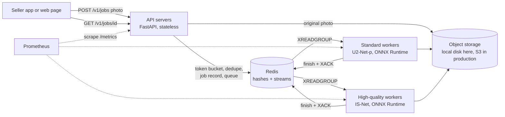
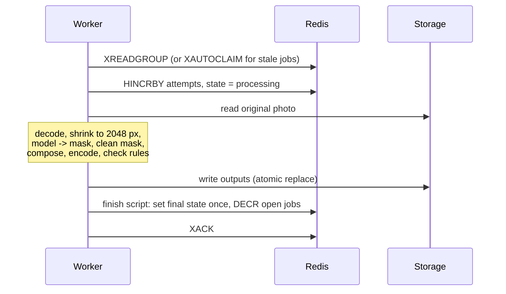

# SnapList — design

This document explains how SnapList works and why it is built this way.
Every number here was measured with `bench/run_benchmarks.py`; the raw results
are in [`benchmarks/results/`](benchmarks/results) and explained in
[BENCHMARKS.md](BENCHMARKS.md).

## 1. The problem

Many small sellers take product photos on a phone, on a table, in normal room
light. Amazon's main product image has strict rules:

- pure white background (RGB 255, 255, 255)
- the product fills 85% or more of the frame
- at least 1000 px on the longest side, so shoppers can zoom
- the whole product is visible (not cut off)

Editing every photo by hand takes time and skill that a small seller often
does not have. SnapList takes one phone photo and returns:

| Output | What it is |
| --- | --- |
| `main.jpg` | 2000 × 2000 Amazon main image, checked against the rules above (always made) |
| `studio-grey.jpg`, `studio-warm.jpg` | the product on a soft studio backdrop with a shadow, for the other image slots |
| `cutout.png` | the product on a transparent background |
| `broll.mp4` | a 5-second slow zoom-and-pan video (B-roll) for the listing |

## 2. Requirements

**Functional**

1. A seller uploads one photo and chooses a quality tier (`standard` or `high`) and extra outputs.
2. The seller can check the job status and download the results.
3. Every main image comes with a compliance report (which rules passed, with measurements).

**Non-functional**

| Need | How SnapList meets it |
| --- | --- |
| Uploads must return fast, even when workers are busy | the API only validates, stores and queues; workers do the heavy work |
| No lost jobs when a worker crashes | Redis Streams pending list + takeover after a visibility timeout |
| No duplicate work when a seller retries (double tap, bad mobile network) | request fingerprint + `SET NX` dedupe + `Idempotency-Key` |
| One seller cannot flood the system | token bucket rate limit per seller |
| Under overload, fail fast and clearly | bounded queue: `503` with `Retry-After` instead of a request that hangs |
| Low cost | CPU only by default; small model for the standard tier |
| Easy to operate | Prometheus metrics for every stage, `/health`, `/v1/stats`, dead-letter queue |

## 3. Architecture

There are three kinds of process. They scale separately:

- **API servers** keep no state. Add more behind a load balancer.
- **Workers** each use one CPU core. Each quality tier has its own queue and its own workers.
- **Redis** holds job records, the queues, rate-limit buckets and dedupe keys.

## 4. What happens to one upload

### 4.1 In the API (`snaplist/api.py`)

1. **Cheap checks first.** Seller id, tier, output names and `Idempotency-Key` format. Bad input gets `400` before any real work.
2. **Rate limit.** One token per upload from the seller's bucket (a Lua script in Redis, so it is atomic across many API servers). Empty bucket: `429` with `Retry-After`.
3. **Read with a size cap** (15 MB) and read only the image *header* to check the format (JPEG, PNG, WEBP) and size (at least 500 px). No full decode in the API.
4. **Fingerprint** = SHA-256 of (photo bytes, tier, outputs).
5. **Idempotency.** Same `Idempotency-Key` + same fingerprint: return the first job (`200`). Same key + different request: `422`, as in the IETF draft for the `Idempotency-Key` header.
6. **Dedupe.** The same seller uploading the same photo with the same options gets the existing job (`200`, header `X-SnapList-Reused`). Sellers never share results with each other.
7. **Load shedding.** If the tier already has `max_open_jobs` queued or running jobs, answer `503` with `Retry-After: 5`.
8. **Claim** the dedupe and idempotency keys with `SET NX`, so ten identical requests at the same moment create exactly one job.
9. **Store the original photo**, then in one Redis `MULTI` transaction: create the job hash, set its TTL, increment the open-jobs counter, `XADD` to the tier's stream.
10. Answer **`202 Accepted`** with a `Location` header pointing at the job.

### 4.2 In a worker (`snaplist/worker.py`)

The message is acknowledged (`XACK`) only after the outputs are stored and the
job record is final. If the worker dies before that, the message stays in the
stream's pending list.

## 5. Key decisions and trade-offs

### 5.1 Async jobs instead of doing the work inside the request

One photo needs about 0.5 s of CPU on the standard tier and about 3 s on the
high tier (model only; see BENCHMARKS.md). Doing that inside the HTTP request
would tie up API servers, break on slow mobile networks, and make API and
model capacity scale together. With a queue, the API accepts an upload in
milliseconds and the worker pool absorbs bursts.

### 5.2 Redis Streams for the queue (and why not Kafka or SQS)

| Option | Good | Not so good here |
| --- | --- | --- |
| **Redis Streams** (chosen) | consumer groups, a pending list per worker, `XAUTOCLAIM` to take over stuck jobs; we already need Redis for rate limits and dedupe, so there is one less system to run | data lives in memory; durability depends on AOF and replicas |
| Kafka | very high throughput, replay, long retention | built for event logs. Progress is one offset per partition, so one slow or poison message holds up its partition. No per-message visibility timeout. Heavy to run for a task queue |
| Amazon SQS | fully managed, visibility timeout and DLQ built in | not available offline. On AWS I would use it: the design maps one-to-one |

The mapping to SQS is direct: `XREADGROUP` ≈ `ReceiveMessage`, `XACK` ≈
`DeleteMessage`, visibility timeout + `XAUTOCLAIM` ≈ SQS visibility timeout,
`max_attempts` + DLQ stream ≈ `maxReceiveCount` + redrive policy.

### 5.3 One queue per quality tier

The high tier's model (IS-Net) is about 6.4 times slower than the standard
tier's (U²-Net-p): about 3.0 s against 0.47 s per image. With one shared queue,
a standard job could wait behind many slow high-quality jobs (head-of-line
blocking). Separate streams and separate worker pools keep the standard tier
fast, and let each pool scale on its own queue depth.

### 5.4 At-least-once delivery, made safe

Exactly-once delivery is not possible in general (a worker can always crash
after doing the work but before saying so). SnapList uses at-least-once
delivery and makes a second delivery harmless:

- outputs are written to fixed keys with an atomic replace (`write tmp` + `os.replace`), so a rerun overwrites with identical files;
- the final state is set by a Lua script that does nothing if the job is already final, and decrements the open-jobs counter in the same atomic step, so a job can never be counted twice;
- a worker that receives a message for a job that is already final just acknowledges it.

### 5.5 Retries, back-off and the dead-letter queue

- A photo that cannot be decoded, or has no product in it, fails at once. Retrying cannot fix it.
- Any other error is retried. The job is left unacknowledged, and the visibility timeout (30 s by default) is the back-off before another worker takes it.
- After `max_attempts` (3) the job is marked `failed` and written to the dead-letter stream `snaplist:dlq` for a person to look at. A poison message can never loop forever.

### 5.6 Load shedding with a bounded queue

An unbounded queue turns overload into very long waits for everybody and
timeouts at the edge. SnapList keeps an exact open-jobs counter per tier
(incremented in the enqueue transaction, decremented in the finish script) and
answers `503 + Retry-After` when it is full. A seller's app can retry later,
and the jobs already accepted still finish on time.

### 5.7 Batching: measured, then switched off on CPU

Batching several images into one model call is a common trick on GPUs. On this
CPU it gave **no gain**: U²-Net-p took 470 ms per image alone, 476–526 ms per
image in batches of 2, 4 and 8. These convolution models already keep the core
fully busy, so batching only adds waiting. The default is `batch_size = 1`.
The worker still supports dynamic batching (wait up to `batch_wait_ms` to fill
a batch), because on a GPU it would pay off. To make batching possible at all,
`snaplist/model.py` rewrites the ONNX graph's fixed batch dimension (1) into a
dynamic one; a test checks that batched and single results match.

### 5.8 Checking the image Amazon will really receive

The compliance check runs on the **JPEG after encoding and decoding**, not on
the clean in-memory image. Two problems showed up only this way:

- the model leaves faint "haze" (alpha 1–19) far from the product, which makes the background off-white. `clean_mask` keeps the largest object (and pieces at least 2% of its size) and zeroes alpha below 20;
- JPEG compression changes a few pixels right next to the product (ringing). The JPEG is saved with full colour resolution (4:4:4) and the white check skips an 8 px band around the product.

### 5.9 Shrinking large photos first

Phone photos are 12–50 megapixels, but the output is 2000 px. Each worker
shrinks the photo to 2048 px on its longest side right after decoding, so
every later step does less work. Composition also blends only the product's
area, not the whole 2000 × 2000 canvas.

### 5.10 Models

| Tier | Model | File | Input | Licence |
| --- | --- | --- | --- | --- |
| standard | U²-Net-p (Qin et al., 2020) | 4.6 MB | 320 × 320 | Apache-2.0 |
| high | IS-Net / DIS (Qin et al., 2022) | 179 MB | 1024 × 1024 | Apache-2.0 |

Both run with ONNX Runtime on one thread per worker. Model files are pinned by
SHA-256 in `scripts/download_models.py` and baked into the Docker image.

## 6. Failure modes

| What goes wrong | What happens | Proof |
| --- | --- | --- |
| Worker is killed in the middle of a job | the job stays pending; another worker takes it over after the visibility timeout | `test_crashed_worker_job_is_taken_over`, chaos benchmark |
| A message is delivered twice | the second finish is a no-op | finish-once Lua script |
| Seller retries the same upload | the first job is returned | dedupe + idempotency tests |
| Bad or tiny photo | `400` at upload; never retried | `test_bad_uploads_are_rejected` |
| Temporary error in a worker | retried; succeeds on attempt 2 | `test_temporary_failure_is_retried` |
| Error that never goes away | 3 attempts, then `failed` + dead-letter queue | `test_job_goes_to_dead_letter_queue_after_max_attempts` |
| Too many uploads at once | `503 + Retry-After` | `test_load_shedding_when_the_queue_is_full`, overload benchmark |
| One seller sends too fast | `429 + Retry-After` for that seller only | `test_rate_limit_per_seller` |
| Redis is down | uploads fail with `5xx`; `/health` reports `redis: false` | — |
| Storing the original fails | dedupe and idempotency keys are released and the file is removed, so a retry works | code in `submit_job` |

## 7. Scaling to 10× and 100×

The numbers come from BENCHMARKS.md.

- **Workers.** One standard worker processes about 90 images a minute on one core (model ≈ 0.5 s, rendering ≈ 0.2 s). Throughput grows with cores, not with processes: 3 workers on 2 cores were no faster than 2. So the rule is one worker per core, and the autoscaler adds workers when `open_jobs / (workers × per-worker rate)` (the expected wait) goes above the target. On Kubernetes that is KEDA on the Redis stream length; on AWS, ECS service auto scaling on a queue-depth metric.
- **API.** Stateless, so add servers behind a load balancer. In production, sellers would upload straight to S3 with a pre-signed URL, so photo bytes never pass through the API.
- **Redis.** Each job costs about 15 Redis commands. One Redis instance handles tens of thousands of commands per second, so it is not the first bottleneck. Beyond that: shard the streams by seller id, or move the queue to SQS.
- **Storage.** Local disk here; S3 in production (same `put/get/exists/delete` interface), with a CDN (CloudFront) in front of the outputs.
- **GPU for the high tier.** IS-Net is 3 s per image on a CPU core. A GPU is the right tool there, and on a GPU the dynamic batching that is switched off on CPU would help.

## 8. What I would add next

- Fair scheduling between sellers *inside* a tier, so one seller's 500-photo upload does not delay everyone else (the rate limit bounds the speed, not the backlog).
- Webhook or SNS notification when a job finishes, instead of polling.
- A quality benchmark on a labelled dataset (for example DIS5K) with IoU and F-measure, and a review queue for low-confidence masks.
- Pre-signed S3 uploads and CloudFront delivery.

## 9. Honest limits

- Throughput numbers come from synthetic 1600 × 1200 photos on a 2-vCPU cloud machine. Real photos of different sizes will differ.
- The `video` output uses a simple Ken Burns zoom-and-pan, not a generative model.
- Storage is local disk; S3 is described, not implemented.
