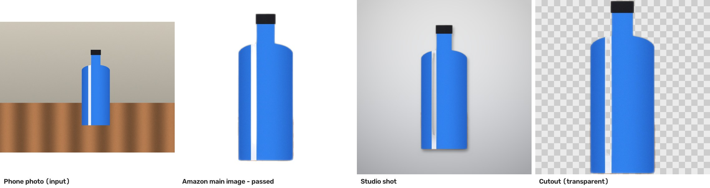
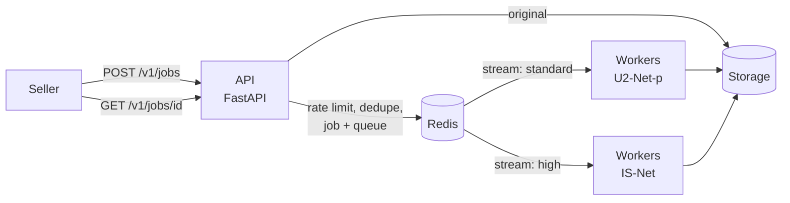

# SnapList

**Turns a seller's phone photo into Amazon-ready listing images.**

A small seller takes a photo of a product on a table. SnapList removes the
background with a neural network, places the product on a pure white
2000 × 2000 canvas so it meets Amazon's main-image rules, checks those rules on
the final JPEG, and can also make studio shots, a transparent cutout and a
short B-roll video.



It is built as a small production-style backend: an async job API, a Redis
Streams work queue with at-least-once delivery, separate queues per quality
tier, idempotent uploads, per-seller rate limits, load shedding, retries with
a dead-letter queue, Prometheus metrics, and tests and benchmarks that start
real processes.

## Results (measured, 2 vCPUs)

| What | Result |
| --- | --- |
| Throughput, 1 worker / 2 workers (one per core) | **87 / 161 images per minute** |
| Work per job inside a worker | ≈ 0.7 s (model ≈ 0.48 s, rendering ≈ 0.18 s, decode ≈ 0.02 s) |
| Steady load, 113 uploads/min (70% of capacity) | end-to-end **p50 725 ms, p99 846 ms** |
| 4 busy workers killed with `SIGKILL` during a 120-job run | **0 jobs lost**; the 4 in-flight jobs were taken over |
| 300 uploads at once, queue limit 50 | exactly 50 accepted, 250 fast `503`s, all 50 finished |
| API alone (32 uploads in flight) | 199 uploads/s, p50 154 ms |
| Batching on CPU | measured **no gain** (473 ms per image alone, 478–487 ms in batches), so it is off |
| Main images that passed all Amazon rule checks | 876 / 876 across all runs |

Details and the raw JSON: [BENCHMARKS.md](BENCHMARKS.md). Design and
trade-offs: [DESIGN.md](DESIGN.md).

## What you get

| Output | Description |
| --- | --- |
| `main.jpg` | 2000 × 2000, pure white background (RGB 255), product fills 85% of the frame. Always made, always checked. |
| `studio-grey.jpg`, `studio-warm.jpg` | product on a soft studio backdrop with a shadow (`outputs=studio`) |
| `cutout.png` | product on a transparent background (`outputs=cutout`) |
| `broll.mp4` | 5-second slow zoom-and-pan video, H.264 (`outputs=video`) |

Two quality tiers, each with its own queue and workers:

| Tier | Model | Speed (1 CPU core) |
| --- | --- | --- |
| `standard` | U²-Net-p, 4.6 MB | ≈ 0.47 s per image |
| `high` | IS-Net, 179 MB, cleaner edges (hair, fur) | ≈ 3.0 s per image |

## How it works



1. The API checks the request, applies the seller's rate limit, reads only the image header, fingerprints the request, returns an existing job for a repeated upload, refuses new work if the queue is full, stores the original and enqueues the job in one Redis transaction. It answers `202 Accepted`.
2. A worker takes the job from its tier's stream (`XREADGROUP`), runs the model with ONNX Runtime, cleans the mask, composes the outputs, checks the main image rules on the encoded JPEG, stores the files, marks the job final (once, with a Lua script) and acknowledges it (`XACK`).
3. If a worker dies, its job stays pending and another worker takes it over with `XAUTOCLAIM`. Errors are retried up to 3 times, then the job goes to a dead-letter queue.

## Run it

**Linux, macOS or WSL** (needs Python 3.11+ and `redis-server`):

```bash
./scripts/run.sh                      # Redis, 2 standard workers, API on :8300
STANDARD_WORKERS=2 HIGH_WORKERS=1 ./scripts/run.sh
```

**Docker** (any OS):

```bash
docker compose up --build             # API on :8300, Prometheus on :9090
docker compose up --scale worker-standard=4
```

Then open <http://127.0.0.1:8300> and upload a photo.

## API

```bash
# Submit a photo (main image + studio shots)
curl -s -X POST http://127.0.0.1:8300/v1/jobs \
  -H "X-Seller-Id: seller-42" -H "Idempotency-Key: listing-7731-photo-1" \
  -F image=@shoe.jpg -F tier=standard -F outputs=studio
# -> 202 Accepted, Location: /v1/jobs/<id>

# Check it
curl -s http://127.0.0.1:8300/v1/jobs/<id>
```

A real response (the first job after the worker started, so its caches were still cold):

```json
{
  "job_id": "c500d34c45c0465f8ade70388bbd458f",
  "state": "succeeded",
  "tier": "standard",
  "model": "u2netp",
  "attempts": 1,
  "queue_wait_ms": 2,
  "total_ms": 1400,
  "timings_ms": {"decode_ms": 36.3, "model_ms": 609.1, "render_ms": 751.1, "store_ms": 1.1,
                 "main_ms": 185.3, "studio_ms": 538.4},
  "outputs": {
    "main.jpg": "/v1/jobs/c500d34c45c0465f8ade70388bbd458f/files/main.jpg",
    "studio-grey.jpg": "/v1/jobs/c500d34c45c0465f8ade70388bbd458f/files/studio-grey.jpg",
    "studio-warm.jpg": "/v1/jobs/c500d34c45c0465f8ade70388bbd458f/files/studio-warm.jpg"
  },
  "compliance": {
    "passed": true,
    "checks": {"background_pure_white": true, "product_fills_85_percent_or_more": true,
               "longest_side_at_least_1000px": true, "square_1_to_1": true, "product_not_cut_off": true},
    "measurements": {"background_white_ratio": 1.0, "product_fill_ratio": 0.85,
                     "width_px": 2000.0, "height_px": 2000.0}
  }
}
```

| Endpoint | Purpose |
| --- | --- |
| `POST /v1/jobs` | submit a photo; `202` new job, `200` existing job (repeat upload), `400` bad input, `413` too large, `422` idempotency key reused with a different request, `429` rate limited, `503` queue full |
| `GET /v1/jobs/{id}` | state, timings, output links, compliance report |
| `GET /v1/jobs/{id}/files/{name}` | download an output |
| `GET /v1/stats` | open jobs, pending messages, live workers, dead-letter count |
| `GET /health`, `GET /metrics` | health check, Prometheus metrics |

## Tests

```bash
pip install -r requirements-dev.txt
python scripts/download_models.py
pytest                               # 30 tests, about 30 s; needs redis-server on PATH
```

The integration tests start a real `redis-server` and real worker processes.
They cover: end-to-end jobs, repeated uploads, idempotency replay and
conflict, 10 identical requests at the same moment (exactly one job, with and
without an `Idempotency-Key`), an exact queue limit under 20 concurrent
uploads, bad uploads, rate limiting, load shedding, retries, the dead-letter
queue, and a worker that crashes in the middle of a job.

## Benchmarks

```bash
python bench/run_benchmarks.py all   # about 15 minutes on 2 vCPUs
python bench/make_report.py          # rewrites BENCHMARKS.md from the JSON results
```

## Project layout

```
snaplist/
  api.py         HTTP API (FastAPI)
  jobs.py        job records and queues in Redis (streams, Lua finish script)
  worker.py      worker process: read, process, retry, take over stale jobs
  model.py       background-removal model on ONNX Runtime
  imaging.py     mask cleaning, composition, Amazon rule checks, encoding
  pipeline.py    which outputs to make for a job
  video.py       B-roll video
  ratelimit.py   per-seller token bucket (Lua)
  storage.py     file storage (local disk; S3 in production)
  metrics.py     Prometheus metrics
tests/           unit and integration tests
bench/           benchmark runner and report writer
scripts/         run script, model download, README example picture
benchmarks/      raw benchmark results (JSON)
```

## Credits

- U²-Net (Qin et al., 2020) and IS-Net / DIS (Qin et al., 2022), Apache-2.0. ONNX files from the [rembg](https://github.com/danielgatis/rembg) project; pre- and post-processing follow its reference code.
- Example picture: a synthetic test photo made by `tests/photos.py`.
